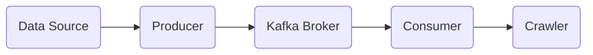

# Belajar Kafka


1. Starting Zookeeper
```bash
bin/zookeeper-server-start.sh config/zookeeper.properties
```

2. Starting Kafka Server
```bash
export KAFKA_HEAP_OPTS="-Xmx256M -Xms128M"
bin/kafka-server-start.sh config/server.properties
```

